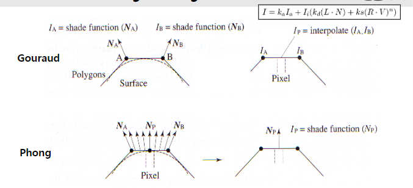
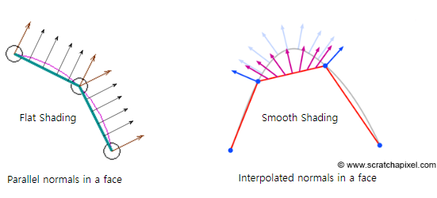

* Date: 2023.06.30

* Local (Direct) illumination
  * 광원에서 나온 빛이 물체를 직접적으로 반사된는 빛
  * 광원 -> 물체 -> 카메라
  
* Global (Indirect) illumination
  * Local illumination에 더해서 다른 surface에서 물체에 반사되는 빛까지 포함
  * 광원 -> 물체 + (다른 표면 + 물체) -> 카메라 

## Phong Reflection Model
* Reflection을 3가지 종류로 나눈다.
* Reflected light = Ambient reflection + Diffuse reflection + Specular reflection
* Ambient reflection
  *  물체 고유의 색. 빛이 없을 때의 물체 색
* Diffuse reflection
  * 광원에서 직접적으로 반사된 빛
  * L : Light Source Direction, N: Surface Normal
  
  $$ I_{d} = I_{i} (L \cdot N) $$
  
* Specular reflection
  * 카메라가 입사각과 반사각이 동일한 그 지점에 있을 때 더 강한 instensity로 반사된다.
  * R : reflection direction, V: Viewing Direction
  * n이 높을수록 더 speculation되는 surface의 면적이 좁아진다. (cos이 더 많이 곱해지므로)
  
  $$ I_{S} = I_{i} (R \cdot V)^n $$

## Interpolative Shading Techniques
* vertice가 포함되어 있지 않은 pixel(intermediate pixel)을 계산하는 방법에는 크게 gourad shading과 phong shading이 있다. 
  
### Gourad Shading
  * 각 vertice들에서의 normal vector를 구해서 intensity를 구한다.
  * intermediate pixel을 각 vertice들을 기준으로 선형적으로 interpolate한다.
  
### Phong Shading
  * Phong shading과 phong reflection model은 다르다.
  * 각 vertice들에서 normal vector를 구한다. 그리고, intermediate pixel에서의 normal vector를 각각 구한다.
  * 각 normal vector를 기준으로 phong reflection model을 적용해서 color를 구한다.

* Trade-off: Phong Shading은 Gourad Shading보다 computation 양이 많지만, 더 정확하다. 

## Smooth, Flat Shading
* OpenGL에는 curved primitive가 없기 때문에 구와 같은 도형은 삼각형 polygon으로 렌더링된다.

### Flat Shading
  * Flat Shading에서의 vertice normal은 polygon의 face normal을 가져온다. 
  * 그리고 face normal을 그 vertice normal로 일률적으로 처리한다.
  * 이 face normal의 intensity는 일정하기 때문에 surface가 각져 보인다.
  
### Smooth Shading
  * Smooth shading에서의 vertice normal은 vertice 인근의 polygon face normal을 평균내어 결정한다.
  * 그리고 face normal을 vertice normal들을 기준으로 interpolation한다. 
  * 그래서 surface가 smooth 해보인다.

* Flat, Smooth Shading을 구현하는데에는 Gourad와 Phong을 사용할 수 있다.

