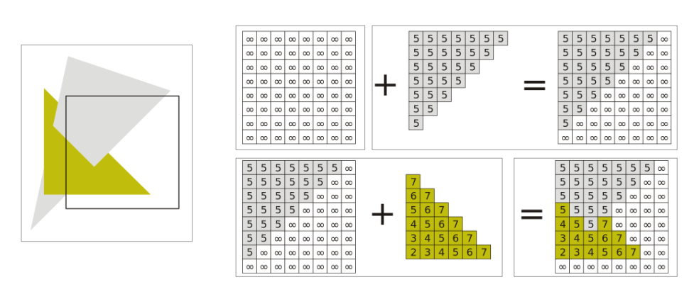

* Date: 2023.07.05

## Depth Testing
* 물체를 그릴때 앞에 있는 부분은 그리고 뒤에 가려져 있는 부분은 그리지 말아야 한다.
* 이를 위해서 Z-Buffer Algorithm을 사용한다.

### Z-Buffer Algorithm
* frame-buffer와 동일한 z-buffer를 만들고 각 pixel에서의 z 값을 저장한다.
* z 값: [view transformation](https://github.com/wani-ham/Today-I-Learned/blob/main/OpenGL/transformation_co-system.md)이 된 후 view space에서의 z 좌표값.
* z 값이 작을수록 camera에 가깝다.
* 두개의 물체가 너무 가까우면 깨져보일 수 있는데, 이를 Z-fighting이라고 한다.

