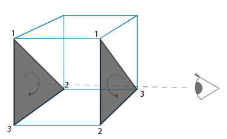
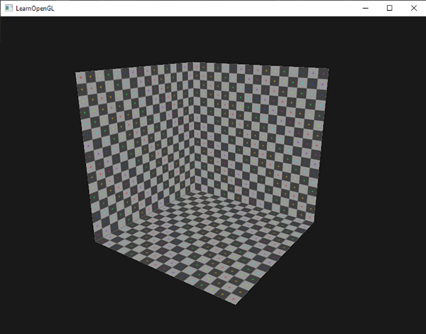

* Date: 2023.07.05

## Face Culling
* Face를 그릴 때 vertex를 시계방향(Clockwise, CW) 또는 반시계방향(Counter-Clockwise, CCW)로 정의할 수 있다. 
* 이 vertex들의 순서규칙을 face의 winding order라고 한다.
* Winding order를 기준으로 face가 앞면(front face)인지 뒷면(back face)인지 정할 수 있다.
* OpenGL에서는 face의 winding order가 CCW이면 front face로 간주한다. CW이면 back face로 간주한다.

### Back Face Culling
* 예컨대 원통형 물통을 그린다고 했을 때, 뚜껑이 있다면 물통의 안쪽면을 그릴 필요가 없다. 
* 이 때 front face만 그리게 한다면, computation 비용을 아낄 수 있다.
* 반대로, back face만 그리게 한다면 아래와 같은 cube도 그릴 수 있다.
* 예전에 유행했던 본디가 연상된다.

