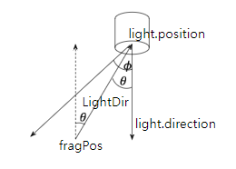

* Date: 2023.07.04

## Light Casters

물체에 빛을 비추는 광원을 "Light Caster"라고 하며 세가지 종류가 있다. 

### 1. Directional Light
* source가 무한히 멀리있다고 가정하여 light ray들이 모두 평행함.
* Fragment shader를 코딩할 때 position은 없고 direction만 있음.

### 2. Point Light
* Directional Light과는 달리 source가 멀리 있지 않음.
* 따라서, light ray들이 평행하지 않기 때문에 attenuation이 있음. (가우스 법칙이 연상됨)
* d: 광원과 물체의 거리, $K_{C}$: constant term, $K_{L}$: linear term, $K_{q}$: quadratic term
  
$$ F_{att} = \frac{1}{K_{C} + K_{L} d + K_{q} d^2} $$

### 3. Spot Light
* Point Light과 비슷하지만, 정해진 범위로만 빛이 비춰짐.
* ${\theta}$는 LightDir과 light.direction을 dot product하여 계산함. (둘다 unit vector라서 cosine 값이 나옴)
* 이 값과 $cos(\phi)$ 값을 비교하여 $\theta$가 범위를 벗어나면 매우 어두운 값을 주어 암흑처리함.

* Smooth/Soft edge를 주려면 inner cone, outer cone을 설정하면 됨.
* inner cone에서 outer cone 사이의 빛은 linear interpolation을 이용하여 점진적으로 세기를 약하게 만들면 됨.

