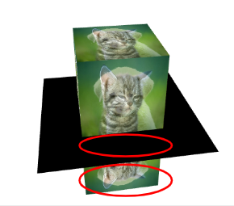
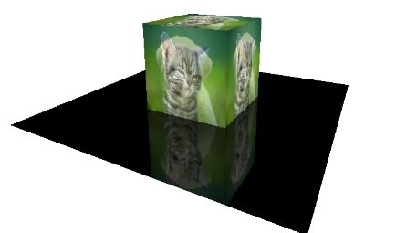

* Date: 2023.07.05

## Stencil Testing

* 화면에 특정영역만 보이게 하고 싶을 때 Stencil Test를 이용한다.
* Depth buffer와 마찬가지로 Stencil Buffer가 있고, 0과 1이 pixel 별로 저장된다.
* 1인 pixel들은 frame에 그려지고 0은 그려지지 않는다.

Source: Lecture Note by [prof. Inkwon Lee](https://cga.yonsei.ac.kr/people/iklee)

### Implementation
* Stencil Testing을 공부하면서 어디에다가 써먹는건지 궁금했었는데 다음과 같은 상황에서 사용할 수 있다.

* 목표는 검은 바닥에 cube가 반사되는 것을 구현하는 것이다.
* Stencil testing을 이용하지 않으면 위의 사진과 같이 
    1. 검은 바닥에 cube가 비춰지지 않고,
    2. 아래에 cube가 삐져나온다.
#### 1번 문제 해결방법
* 위에 있는 cube를 그리고 [depth mask](https://registry.khronos.org/OpenGL-Refpages/gl4/html/glDepthMask.xhtml)를 false로 설정한다.
* 그 후, floor를 그린다. depth mask가 false이기 때문에 depth buffer는 update 되지 않는다. 즉, floor의 z 값은 (initialized된 대로) $\infty$ 로 유지된다.\
* 그렇기 때문에, 아래의 큐브를 그리면 floor에 가려지지 않고, floor위에 그려지게 된다.

#### 2번 문제 해결방법
* 2번 문제를 해결할때 stencil testing이 사용된다.
* floor가 그려지는 부분에만 stencil buffer를 1로 쓴다.
* 그리고 아래의 큐브를 그리면 floor 밖으로 튀어나오는 부분은 안그려지게 된다.

