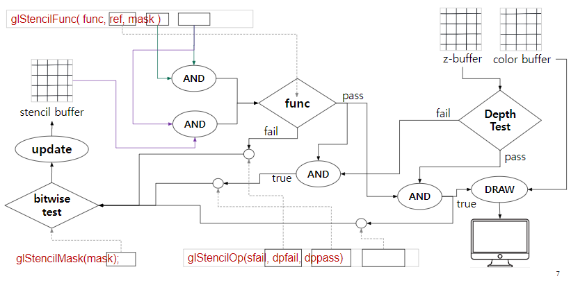

* Date: 2023.07.05

## Stencil Testing

* 화면에 특정영역만 보이게 하고 싶을 때 Stencil Test를 이용한다.
* Depth buffer와 마찬가지로 Stencil Buffer가 있고, 0과 1이 pixel 별로 저장된다.
* 1인 pixel들은 frame에 그려지고 0은 그려지지 않는다.

Source: Lecture Note by [prof. Inkwon Lee](https://cga.yonsei.ac.kr/people/iklee)

### Implementation
* Stencil Testing을 공부하면서 어디에다가 써먹는건지 궁금했었는데 다음과 같은 상황에서 사용할 수 있다.
